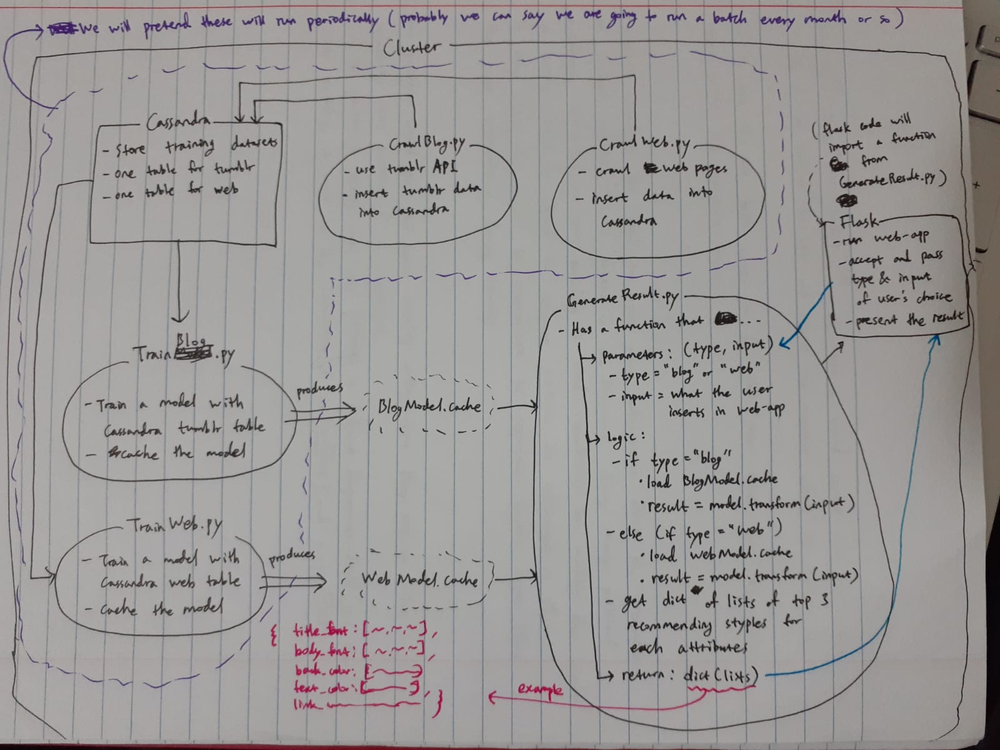

# WebcrawlStyleCreator

<b>Project Submission:</b> https://coursys.sfu.ca/2019fa-cmpt-732-g1/+proj/submission/

<b>Due Date:</b> 2019-12-06

<b>Demo Day:</b> 20190-12-05 10am - 1pm in the Big Data atrium

pip install flask
pip install flask-wtf
# python run.py

# Tasks Due for Nov 20th

# Tasks Due for Nov 28th

# Project Outline

# Next meeting: After ML Exam on Dec 2nd
# After that, after the ML meeting on Dec 4th

<b>I) pipeline python file (<u>Donggu</u>) </b>

		○ 1. AlexaWebsitesGeneration.ipynb (to py)

		○ 2. WebStyleCrawler.py (Needs 1. to finish and needs to be modified to go into Cassandra -- see J)

		○ 3. ExampleWordVectorDistance.ipynb (to py + Needs 2. to finish, and needs to be modified to use Cassandra instead of CSV -- see K)

		○ 4. BlogCrawling_blognames.py (Can run in parallel with above tasks)
			- modify (at the moment it only gets from user adriwong)

		○ 5. BlogCrawling_bloginfo.py (Needs 4. to finish. Also note that it uses a command to run the etl_tumblr_to_cassandra.ipynb -- that notebok might need to be converted into a python script as well)

		(We'll add the LDA task and tumblr vector distance python scripts into the pipeline after the main scaffold is set up)

	
<b>J) modify web scraber python file to be spark and into cassandra (<u>Donggu</u>)</b>
	

<b>K) generic web: modify word vector model builder to read from a cassandra datasource instead of a csv source (<u>Matt</u>)</b>
	

<b>L) tumblr: modify word vector model builder to read from a cassandra datasource instead of a csv source (<u>YoungMin</u> in Lab ?)</b>

<b>M) the report (<u>Everyone -> Adriena</u>):</b>

		○ Problem definition
			§ challenges
			
		○ methodology:
		
		○ problems
		
		○ results
		
		○ project summary

		Give youself a total of 20 points for each category:
		
			Getting the data: 
			
			Acquiring/gathering/downloading. ETL: 
			
			Extract-Transform-Load work and cleaning the data set. 
			
			Problem: Work on defining problem itself and motivation for the analysis. 
			
			Algorithmic work: Work on the algorithms needed to work with the data, including integrating data mining and machine learning techniques. 
			
			Bigness/paralleli:
			
		

<b>N) running.txt (<u>anyone</u>):</b>

		- just need to add a line for running donggu's shell script
		

<b>O) Popular topics (<u>Matt</u>):</b>

		- LDA

		latent dirichlet allocation

		PyLDAVis (you can pip install it)

# Authenticate via OAuth
client = pytumblr.TumblrRestClient(
	'nAvaCgNT6dVls4dxKYnWyM1as57L0aSAkSXAayRCPEtNxJSQjr',
	'TTzXwu7KXmCFJRjXlIH1uo6WNHAo3R3UMXRPTyv4gMttowpP2l',
	'OGPUydr4VSZd5mWm2BLwTTwqLLSdrN2aO1Lt9VxsvtWpUA6cvV',
	'o2wNReoRnc1JLr0rh06Ss8NJdc0UgTitifp0Sdltu6ko3xkQNW'
)

