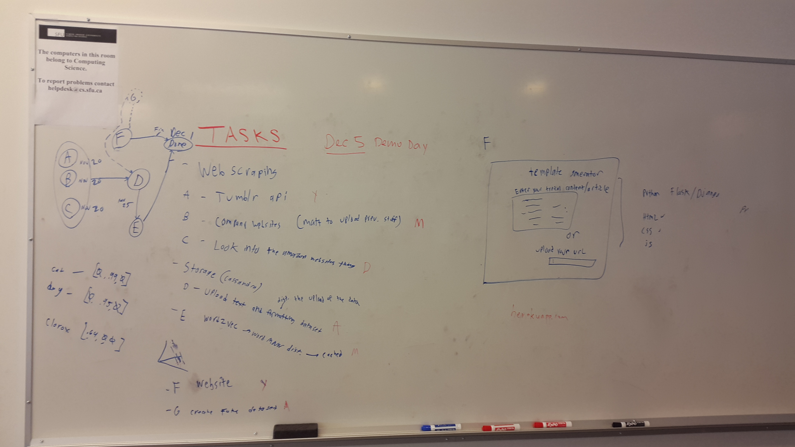
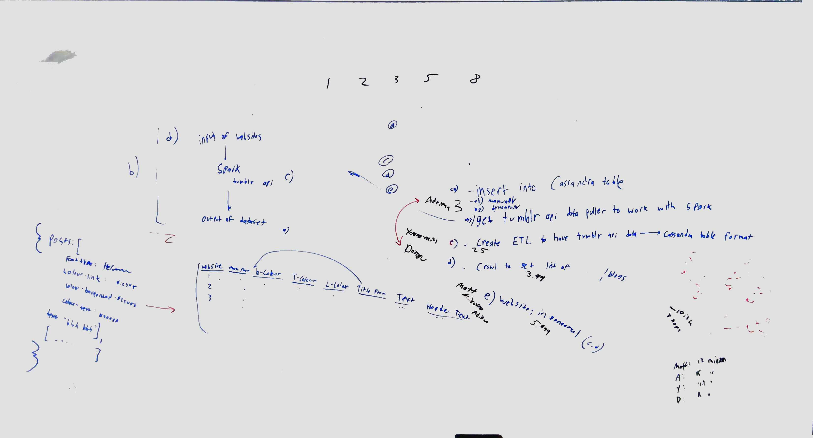
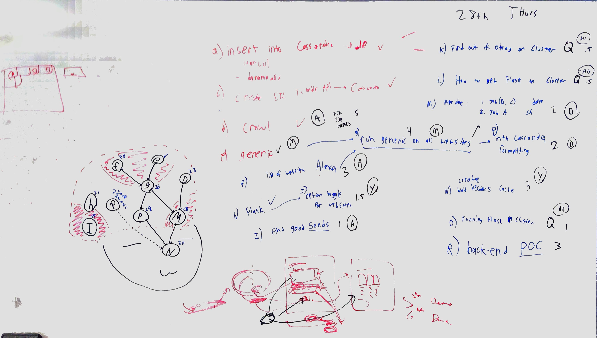

# WebcrawlStyleCreator

<b>Project Submission:</b> https://coursys.sfu.ca/2019fa-cmpt-732-g1/+proj/submission/

<b>Due Date:</b> 2019-12-06

<b>Demo Day:</b> 20190-12-05 10am - 1pm in the Big Data atrium

# Tasks Due for Nov 20th

# Tasks Due for Nov 28th

# Authenticate via OAuth
client = pytumblr.TumblrRestClient(
	'nAvaCgNT6dVls4dxKYnWyM1as57L0aSAkSXAayRCPEtNxJSQjr',
	'TTzXwu7KXmCFJRjXlIH1uo6WNHAo3R3UMXRPTyv4gMttowpP2l',
	'OGPUydr4VSZd5mWm2BLwTTwqLLSdrN2aO1Lt9VxsvtWpUA6cvV',
	'o2wNReoRnc1JLr0rh06Ss8NJdc0UgTitifp0Sdltu6ko3xkQNW'
)

